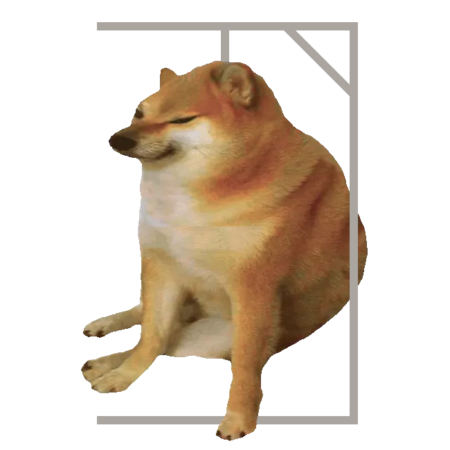

# hooligans-hangman-bot



## Setup

1. create virtual environment for python libraries

```
python3 -m venv hooligan-venv
```

2. activate virtual environment

```
source hooligan-venv/bin/activate
```

3. install required libraries from requirements.txt

```
pip3 install -r requirements.txt
```
